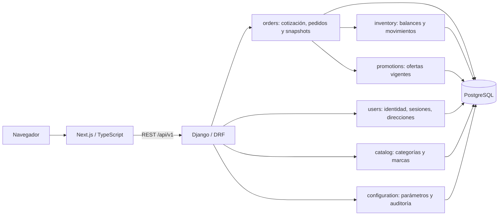

# Arquitectura vigente y contratos del Sprint 1

Referencia: CO-29, CO-28 y Sprint Jira 71, consultados el 6 de octubre de 2026.
La planificación vigente tiene siete sprints; los reportes de septiembre conservan
su carácter histórico y no sustituyen esta organización.

## Componentes

Monolito modular, sin Redis, Celery ni microservicios. Frontend con formularios
cliente y proxy del mismo origen. Django concentra validaciones, autorización,
transacciones y persistencia. PostgreSQL también se usa en pruebas.

## Datos implementados en este alcance

| Entidad | Restricciones / relaciones |
| --- | --- |
| users | Correo único sin distinguir mayúsculas; rol CLIENT/ADMIN; password con hash |
| auth_sessions | Usuario 1:N sesiones; refresh rotativo, vencimiento y revocación |
| addresses | Usuario 1:N direcciones; campos obligatorios; como máximo una principal por usuario |
| categories / brands | Nombre sin duplicados case-insensitive, slug único, estado activo |
| store_settings | Clave única y valor tipado validado por API |
| SettingChange / CatalogChange (modelos de auditoría) | Actor, cambio y fecha de operaciones administrativas |
| orders / order_items | UUID, clave idempotente por usuario, importes decimales, snapshots y movimiento SALE único por línea |
| order_deliveries | Relación 1:1 con pedido; copia de destinatario/dirección, modalidad y costo |
| payments / historiales | Pago 1:1; estados separados PENDING/PENDING, T1 persistido y actor/fecha iniciales |
| inventory_balances / stock_movements | Balance no negativo; entrada o venta con saldo previo/final y actor |
| promotions / promotion_variants | Fechas válidas y precio fijo por variante; ofertas superpuestas bloqueadas |

La primera dirección se marca principal. Seleccionar otra principal es una operación
atómica con bloqueo de la fila de usuario y restricción parcial UNIQUE en PostgreSQL.
Desmarcar o eliminar la principal puede dejar cero principales; no se elige otra sin
acción del cliente. La API recarga la dirección dentro del bloqueo para evitar
actualizar un objeto eliminado por otra solicitud.

Las relaciones de productos con categoría/marca usan PROTECT. Desactivar una
categoría o marca conserva relaciones y excluye sus productos de la política
`Product.objects.visible()`. La lista pública solo devuelve taxonomías activas.

## API y permisos

| Método | Ruta bajo /api/v1 | Autorización |
| --- | --- | --- |
| POST | /auth/register/ | Público + CSRF; nunca permite ADMIN |
| POST | /auth/login/, /auth/refresh/, /auth/logout/ | CSRF y credenciales/cookies según operación |
| GET/PATCH | /users/me/ | Sesión; solo nombre y correo editables |
| GET/POST | /users/me/addresses/ | Sesión; propietario tomado de request.user |
| GET/PATCH/DELETE | /users/me/addresses/{id}/ | Propietario; ajena o inexistente devuelve 404 |
| GET | /categories/, /brands/ | Público, paginado, solo activas; search por nombre/slug |
| GET/POST/PATCH/DELETE | /admin/categories/, /admin/brands/ | ADMIN; mutaciones con CSRF |
| GET/PATCH | /admin/settings/ | ADMIN; mutaciones con CSRF, validación y auditoría |
| GET | /settings/public/ | Solo habilitación, número y mensaje WhatsApp |
| GET | /purchase/variants/ | Público; variantes activas, stock, imagen, precio y TTL del carrito |
| POST | /checkout/preview/ | Sesión + CSRF; dirección propia y total autoritativo, sin reservar stock |
| GET/POST | /orders/ | Propietario; creación con CSRF, Idempotency-Key y quote_token |
| GET | /orders/{number}/, /orders/{number}/payment-instructions/ | Solo propietario; 404 para pedido ajeno |
| GET | /admin/inventory/, /admin/inventory/movements/ | ADMIN; lista paginada y ledger |
| POST | /admin/inventory/entries/ | ADMIN + CSRF; entrada con cantidad y motivo |
| POST | /orders/{number}/payment-report/ | Propietario + CSRF; referencia validada, reporte atómico sin confirmar fondos |

GET /health/ realiza una consulta a PostgreSQL. Errores REST:
`{code, message, details}`. 400 validación; 401 sesión; 403 rol/CSRF; 404 recurso
no visible; 409 conflicto de correo/relaciones; 429 límite de autenticación.
Las listas de catálogo tienen página de 20 y máximo 100 por petición.
Direcciones se devuelven como lista completa de la libreta del usuario.

JWT en cookies HttpOnly, SameSite=Lax; Secure en producción HTTPS. Desarrollo
local permite HTTP. Ningún JWT en localStorage. Logout revoca incluso copias
previas de access/refresh. Datos privados y respuestas de configuración usan
Cache-Control: no-store. Refresh se serializa por sesión.

## Diseño de los sprints siguientes

El modelo completo de CO-29 y del documento maestro define 20 entidades:
users, addresses, categories, brands, products, product_images, variants,
category_attributes, variant_attribute_values, inventory_balances, stock_movements,
promotions, promotion_variants, orders, order_items, payments,
payment_status_history, order_status_history, order_deliveries y store_settings.
Las tablas de auditoría y sesión son auxiliares técnicas.

Usuario 1:N pedidos; pedido 1:N items, 1:1 pago y 1:1 entrega; producto 1:N
imágenes/variantes; variante 1:1 balance, 1:N movimientos y N:M promociones.
El código previo incluye productos/variantes y trabajo de inventario; estos no
constituyen evidencia de terminación de los sprints nuevos.

## Checkout y pedidos adelantados al Sprint 1

El usuario autorizó el 06/10/2026 mover HU-11/CO-58 y HU-12/CO-39 desde los
sprints 4/5 al Sprint 1. Se implementaron dirección guardada en checkout y copias
históricas de producto, variante, SKU, precio, promoción, destinatario y entrega.
Editar o borrar la dirección no cambia pedidos existentes. Pruebas reales:
`backend/tests/test_orders.py` y `frontend/e2e/sprint1-orders.spec.ts`.

POST /orders/ usa transaction.atomic, bloqueo de usuario/productos/taxonomías/
variantes/balances/configuración/promociones, orden estable de bloqueos y restricción
única (usuario, Idempotency-Key). Usuario y variante usan NO KEY UPDATE para no
bloquear los controles FK de entradas de inventario. La misma solicitud devuelve
el mismo pedido; cambiar el cuerpo con la misma clave devuelve 409. Un fallo revierte
pedido, líneas, balance, movimiento SALE, pago, entrega e historiales.

La revisión emite un token firmado con usuario y hash del desglose, vigente 15 minutos.
Confirmar revalida todo y exige nueva revisión ante cambios de precio, promoción,
dirección o envío. Precio y total enviados por cliente se rechazan. La UI conserva
la clave/cuerpo en sessionStorage para recuperar una respuesta perdida incluso tras
recargar; nunca almacena tokens de autenticación allí. Carrito en localStorage con
TTL configurable, sin reserva. Un intento incierto impide editar la compra hasta
recuperar su resultado.

T1 se lee al crear el pedido y report_deadline_at queda persistido. Cambiar T1 o
tarifas solo modifica pedidos nuevos. El reporte mínimo de pago ahora lee T2 de
configuración, persiste reported_at/review_deadline_at/referencia y un historial
REPORTED en una sola transacción. Bloquea pedido/pago y parámetro T2. La misma
referencia repetida devuelve el reporte sin ampliar el plazo; otra referencia
devuelve 409. Propietario ajeno recibe 404. No acepta reporte inicial en el límite
exacto de T1 o después, ni en estados incompatibles.

T1 permanece almacenado como dato histórico, pero solo está activo mientras el pago
es PENDING; report_window_active es falso tras reportar. Cambiar T2 afecta reportes
nuevos, no los plazos existentes. Una restricción DB exige referencia/fecha/T2 válido
para REPORTED. La automatización de vencimientos y su política siguen en CO-130;
no se simulan cancelaciones ni confirmación de fondos. Reportado no es Confirmado.

Política confirmada expresamente por el usuario el 06/10/2026: recogida gratis,
tarifa urbana Pasto configurable, umbral gratis sobre neto tras descuentos; zonas
especiales sin total definitivo ni confirmación. Promoción activa/vigente de precio
fijo inferior al base; no acumulación y bloqueo de superposiciones. No se configuraron
promociones ni cuentas bancarias reales. Instrucciones externas editables por ADMIN;
si faltan, la pantalla informa que aún no están configuradas.

Se reutiliza inventario previo y se añade pantalla de entradas/ledger para la demo.
No se declara completo HU-24, CRUD de promociones HU-27, tarifa especial HU-28,
HU-14 integral frente a scheduler, confirmación de pago, cancelación/restitución,
scheduler ni despliegue STAGING. El reporte mínimo se integra como dependencia del
criterio T2 de EN-01; HU-14 conserva su planificación hasta acordar su traslado.
Las historias futuras conservan esos alcances y su aceptación independiente.

## Entornos y evidencias

`tti`: desarrollo normal. `test_tti`: pytest temporal. `tti_e2e`: navegador aislado.
`tti_sprint1_demo`: exposición persistente en localhost:3002/127.0.0.1:8002.
La demo no modifica la base normal. Secretos locales están fuera de Git; la cuenta
de demostración documentada se crea únicamente en la base local de demo.

[Wireframes de las 28 vistas](wireframes.html) cubren las prioridades A-D, estados
de carga/vacío/error, falta de stock, navegación y estados separados de pago/pedido.
Son prototipos de revisión, no funcionalidades implementadas de los sprints futuros.

[Guion, trazabilidad y resultados](sprint-1-current.md).
